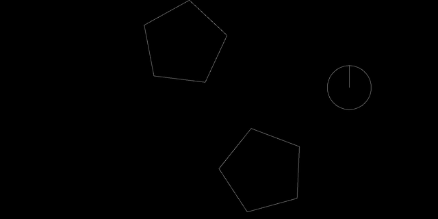
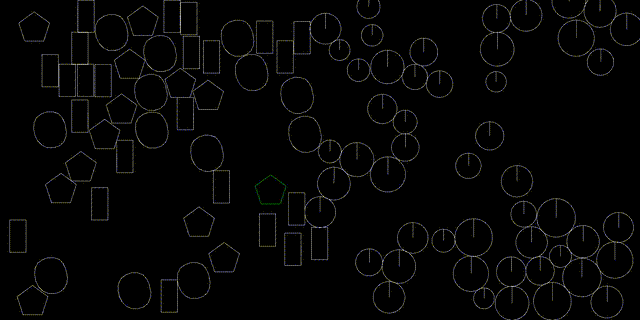

# 2D Physics Engine (C++)

A deterministic, real-time 2D rigid-body physics engine built from scratch in modern C++.
Supports convex polygon and circle collisions, accurate impulse resolution, and friction (static and dynamic).

---

## Features

- SAT-based collision detection for convex polygons
- Circle-circle and circle-polygon resolution
- Border collision handling with restitution and friction
- Impulse-based solver with mass, inertia, and Coulomb friction
- Deterministic fixed time step
- Clean C++ architecture (no external physics libs)

---

## Visual Demos

**Convex + circle impulse and friction resolution**



**Real-time piling stability despite mass disparities**



---

## Notes

- Performs well in typical 2D use cases
- Deterministic under fixed timestep
- Not optimized for extreme stacking or mass disparity
- No positional correction or broadphase (by design)

---

## Build (Linux only)

```sh
sudo apt install libsfml-dev
git clone https://github.com/your-username/physics-engine.git
cd physics-engine
make
./bin/physics_demo
```

---

## Dependencies

- **GLM** for vector math
- **SFML** for simple debug rendering
